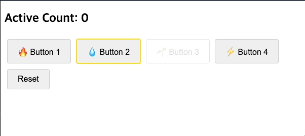

# (미션) 복합 상태 버튼 그룹 스타일링 및 관리

## 개요

이 미션에서는 **리액트의 `useState` 훅**, **CSS Modules** 및 **classnames** 라이브러리를 활용하여,  
여러 개의 버튼을 포함한 **버튼 그룹** 컴포넌트를 구현합니다.  
각 버튼은 **토글 가능한 active 상태**와 **비활성화(disabled) 상태**를 가지며,  
조건부 스타일링을 통해 서로 다른 스타일이 적용되어야 합니다.

## 요구사항

### 1. CSS Modules 파일 생성하기

- `ButtonGroup.module.css` 파일을 생성하고, 다음과 같은 클래스를 정의하세요:
  - **`button`**: 기본 버튼 스타일
  - **`active`**: 버튼이 활성화(active) 상태일 때 적용할 스타일 (예: 배경색 변경, 글자 색 변경)
  - **`disabled`**: 버튼이 비활성화(disabled) 상태일 때 적용할 스타일 (예: 투명도 감소, 커서 변경)
  - **`highlight`**: 특정 조건에 따라 버튼에 강조 효과를 주기 위한 스타일 (예: 테두리 또는 그림자)

### 2. 컴포넌트 구현 및 역할 정의

- **App 컴포넌트**

  - 버튼 데이터를 정의합니다.
  - 버튼 데이터는 상태 변수로 재가공하지 않습니다.
  - 초기 데이터의 `initialButtons`를 참고하세요.

- **ButtonGroup 컴포넌트**

  - **Props**: 버튼 데이터 배열을 받아서 각 버튼을 렌더링합니다.

    - 각 버튼 데이터는 `id`, `label`, `icon`, `isDisabled` 속성을 포함합니다.
    - 각 버튼은 개별적으로 `active` 상태를 관리해야 합니다.
    - 버튼을 클릭하면 해당 버튼의 `active` 상태가 토글됩니다.
    - 단, 버튼이 `isDisabled` 상태이면 클릭해도 상태가 변경되지 않아야 합니다.

  - **classnames** 라이브러리를 사용하여, 각 버튼에 아래 조건에 맞는 클래스를 적용합니다:
    - 항상 기본 스타일 `button` 클래스를 적용합니다.
    - 버튼이 활성화 상태이면 `active` 클래스를 추가합니다.
    - 버튼 데이터의 `isDisabled` 속성이 `true`이면 `disabled` 클래스를 추가합니다.
    - id가 2인 버튼에 대해 `highlight` 클래스를 추가합니다.

- **Active Count 표시**

  - 버튼 그룹 상단에 현재 활성(active) 상태인 버튼의 개수를 표시하는 UI를 구현합니다.

- **Reset 기능**
  - 전체 버튼의 `active` 상태를 모두 초기화(비활성화)하는 "Reset" 버튼을 추가합니다.
  - Reset 버튼 클릭 시, 모든 버튼의 `active` 상태가 `false`로 변경되어야 합니다.

### 3. 초기 데이터

- **초기 버튼 데이터**

```javascript
// 초기 버튼 데이터: 각 버튼은 id, label, icon, isDisabled 속성을 가집니다.
const initialButtons = [
  { id: 1, label: "Button 1", icon: "🔥", isDisabled: false },
  { id: 2, label: "Button 2", icon: "💧", isDisabled: false },
  { id: 3, label: "Button 3", icon: "🌱", isDisabled: true },
  { id: 4, label: "Button 4", icon: "⚡", isDisabled: false },
];
```

- **모듈 CSS 코드**

```css
// ButtonGroup.module.css
.button {
  padding: 10px 20px;
  font-size: 16px;
  margin: 5px;
  border: 1px solid #ccc;
  border-radius: 4px;
  transition: background-color 0.3s, color 0.3s;
  cursor: pointer;
}

.active {
  background-color: #007bff;
  color: #fff;
}

.disabled {
  opacity: 0.5;
  cursor: not-allowed;
}

.highlight {
  border: 2px solid gold;
}
```

### **예상 렌더링 모습**

- 마우스 클릭시 나오는 검은색 동그라미는 캡쳐 프로그램 효과이므로 무시하시면 됩니다  
  

---

## 해결 목표

1. **CSS Modules와 classnames 사용법 익히기**

   - 모듈화된 CSS 파일을 통해 컴포넌트 스타일을 관리하고, 조건부로 클래스를 적용하는 방법을 학습합니다.

2. **상태 관리 및 이벤트 핸들링**

   - `useState`를 활용하여 개별 버튼의 active 상태를 관리하고, 버튼 클릭 이벤트를 처리하는 방법을 익힙니다.
   - 전체 버튼 그룹의 활성 버튼 수를 계산하고, Reset 기능을 구현합니다.

3. **조건부 스타일링 적용**
   - classnames 라이브러리를 사용하여 다양한 상태에 따른 CSS 클래스를 동적으로 적용하는 방법을 연습합니다.

---

이 미션을 통해, **복합 상태 버튼 그룹**을 구현하면서
**CSS Modules**, **classnames** 및 **리액트의 상태 관리와 이벤트 핸들링**의 실제 활용 사례를 심도 있게 학습할 수 있습니다.
추가적으로, 다양한 UI 컴포넌트에 동일한 패턴을 적용해 보며 스타일 관리에 대한 이해도를 높여보세요!
