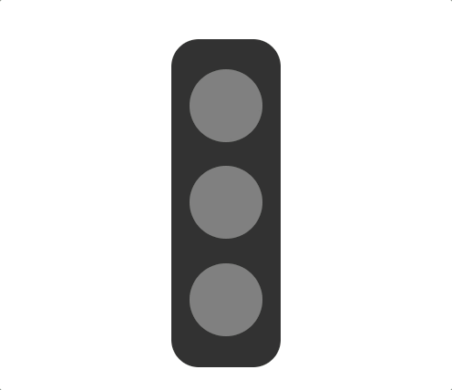

# (미션) Styled Components를 활용한 신호등 스타일링 및 애니메이션 적용

## 개요

이 미션에서는 **리액트의 `useState` 훅**, **Styled Components**, 및 **keyframes 애니메이션**을 활용하여  
클릭 시 색상이 변경되는 **신호등 컴포넌트**를 구현합니다.  
각 신호등 버튼은 **빨간색, 노란색, 초록색**을 가지며,  
각 버튼을 클릭하면 해당 버튼이 활성화되면서 애니메이션 효과가 적용됩니다.

---

## 요구사항

### 1. 미션에서 주어지는 실습 프로젝트를 다운로드 받기

- 미션에 첨부된 프로젝트를 다운 받으면 HTML, CSS, JS 파일이 있습니다.
  - 또는 예제 코드 08-13(Mission)/quiz 폴더에도 있습니다.
- 해당 프로젝트는 다음과 같은 기능이 있습니다.
  - 기본 신호등 색 (gray)
  - 클릭하면 액티브 색 표시
  - 등에 마우스를 올리면(hover) 색상이 점멸 표시
- 해당 HTML 파일과 CSS 파일을 그대로 참고해서 스타일드 컴포넌트 + 리액트 상태 관리로 만들어보는 게 목표입니다. (마우스 클릭시 발생하는 검은원은 제외)

  

### 2. Styled Components 및 애니메이션 적용

- **Styled Components를 사용하여 스타일을 적용**하세요.
- `keyframes`를 활용하여 **신호등 불빛이 깜빡이는 애니메이션 효과**를 추가하세요.
- 스타일 구성:
  - **기본 상태:** 회색(`gray`)으로 표시
  - **활성 상태 (`active`):**
    - 배경색이 해당 색상(빨강, 노랑, 초록)으로 변경
    - `box-shadow`를 추가하여 빛이 퍼지는 효과 적용
  - **호버 상태 (`hover`):**
    - 해당 색상(빨강, 노랑, 초록)이 깜빡이는 애니메이션 적용

### 3. `useState`를 활용한 상태 관리

- **현재 활성화된 신호등 색상을 `useState`를 사용하여 관리**합니다.
- 초기값은 `"gray"` (모든 버튼이 비활성 상태)로 설정합니다.
- **버튼 클릭 시 해당 버튼의 색상이 활성화**되도록 `setActiveColor`를 업데이트합니다.

### 4. 컴포넌트 구조

- **`TrafficLightComponent`**
  - 신호등의 컨테이너 역할을 하는 `TrafficLight` Styled Component를 포함합니다.
  - 각 신호등 버튼을 `LightButton` Styled Component를 사용하여 렌더링합니다.
  - `useState`를 사용하여 클릭된 버튼의 색상을 업데이트합니다.

### 5. 애니메이션 구현

- `keyframes`를 사용하여 깜빡이는 효과를 정의합니다.
- 호버 시 애니메이션(`@keyframes`)을 적용하여 색상이 점멸되도록 설정합니다.

---

## 해결 목표

1. **Styled Components 사용법 익히기**

   - `styled-components`를 활용하여 컴포넌트별 스타일을 적용하는 방법을 익힙니다.

2. **조건부 스타일링 및 애니메이션 적용**

   - `props`를 기반으로 스타일을 동적으로 변경하는 방법을 이해하고, 애니메이션을 추가하는 연습을 합니다.

3. **상태 관리 및 이벤트 핸들링**

   - `useState`를 사용하여 버튼 클릭 이벤트를 처리하고, 상태를 업데이트하는 방법을 학습합니다.

4. **반응형 및 재사용 가능한 컴포넌트 설계**
   - 다양한 UI 요소에도 적용할 수 있도록 **재사용 가능한 스타일과 로직을 구현**합니다.

---

이 미션을 통해, **Styled Components**와 **keyframes 애니메이션**을 활용하여  
동적으로 상태가 변경되는 신호등 UI를 구현하는 방법을 익힐 수 있습니다.  
추가적으로, 버튼의 크기나 배치 등을 변경하면서 다양한 스타일링 옵션을 실험해 보세요!
